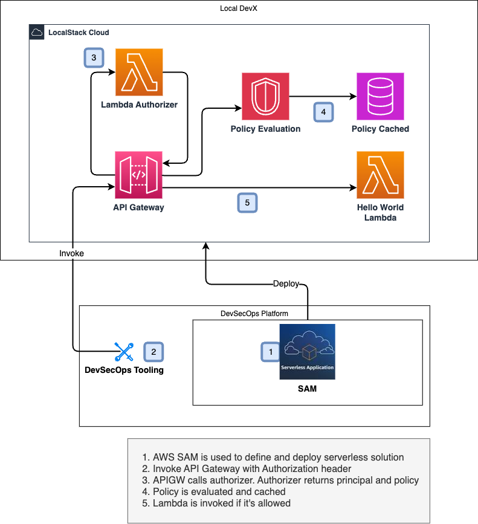

# AWS Serverless Application Model (SAM) with LocalStack Lambda and Authorizer
Demonstrates how to use AWS SAM with LocalStack to create a Lambda function and an API Gateway with an authorizer.



## Prerequisites

* LocalStack
* Docker
* `make`
* [`awslocal`](https://github.com/localstack/awscli-local)
* [`samlocal`](https://github.com/localstack/aws-sam-cli-local)
* NodeJS 18.x
* [`ulid`](https://www.npmjs.com/package/ulid)

## Installing

Setup [Serverless Application Model (SAM)](https://docs.aws.amazon.com/serverless-application-model/latest/developerguide/serverless-sam-cli-install.html) and [AWS SAM CLI Local](https://github.com/localstack/aws-sam-cli-local) on your local machine. We also recommend using NodeJS 14.x alongside a [Node Version Manager](https://github.com/nvm-sh/nvm) to manage your NodeJS versions.

Create a file named `.env-local` and put your LocalStack Auth Token in it. It is ignored by gitignore.
```shell
export LOCALSTACK_AUTH_TOKEN=<your-token>>
```

Start LocalStack via:

```sh 
localstack start -d
```

## Deploy the application

Let us first install the local dependencies:

```sh
make install
```

To setup the infrastructure on LocalStack, run:

```sh
make deploy
```

You will be prompted to enter a name for the stack. Use the default options for the prompts and fill `Y` (`Yes`) for the confirmation prompt. The stack will be created and the output will be printed to the console.


After deploying, you can invoke the Lambda function using the following commands:
```sh
make invoke-allow
make invoke-deny
make invoke-unauthorized
make invoke-none
```
