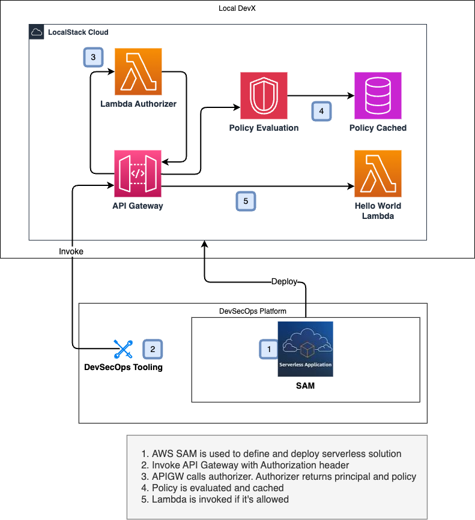

# AWS Serverless Application Model (SAM) with LocalStack Lambda and Authorizer
Demonstrates how to use AWS SAM with LocalStack to create a Lambda function and an API Gateway with an authorizer.



## Prerequisites

* A valid [LocalStack for AWS license](https://localstack.cloud/pricing). Your license provides a [`LOCALSTACK_AUTH_TOKEN`](https://docs.localstack.cloud/aws/getting-started/auth-token/) to activate LocalStack.
* [`lstk` CLI](https://docs.localstack.cloud/aws/developer-tools/running-localstack/lstk/).
* Docker
* `make`
* [AWS CLI](https://docs.localstack.cloud/user-guide/integrations/aws-cli/), required by `lstk aws`.
* [Serverless Application Model](https://docs.aws.amazon.com/serverless-application-model/latest/developerguide/serverless-sam-cli-install.html), used via the `lstk sam` proxy.
* NodeJS 18.x
* [`ulid`](https://www.npmjs.com/package/ulid)

## Installing

Setup [Serverless Application Model (SAM)](https://docs.aws.amazon.com/serverless-application-model/latest/developerguide/serverless-sam-cli-install.html) on your local machine. We also recommend using NodeJS 14.x alongside a [Node Version Manager](https://github.com/nvm-sh/nvm) to manage your NodeJS versions.

Start LocalStack with the `LOCALSTACK_AUTH_TOKEN` pre-configured:

```shell
export LOCALSTACK_AUTH_TOKEN=<your-auth-token>
make start
```

Optionally, create a file named `.env-local` to persist your token (it is ignored by gitignore):
```shell
export LOCALSTACK_AUTH_TOKEN=<your-auth-token>
```

## Deploy the application

Let us first install the local dependencies:

```sh
make install
```

To setup the infrastructure on LocalStack, run:

```sh
make deploy
```

You will be prompted to enter a name for the stack. Use the default options for the prompts and fill `Y` (`Yes`) for the confirmation prompt. The stack will be created and the output will be printed to the console.


After deploying, you can invoke the Lambda function using the following commands:
```sh
make invoke-allow
make invoke-deny
make invoke-unauthorized
make invoke-none
```
